<!-- Github Profile README -->

<div align="center">


# Hey there, I'm Vang! 👋✨


<p>
  
  
  
</p>

</div>

---

## 🚀 About Me


```javascript
const AwaaaFrens = {
    pronouns: "she" | "her",
    location: "Indonesia 🇮🇩",
    currentFocus: ["Laravel", "React", "Cloud Architecture"],
    askMeAbout: ["web dev", "tech", "clean code", "coffee"],
    technologies: {
        frontEnd: {
            js: ["React"],
            css: ["TailwindCSS", "Bootstrap"]
        },
        backEnd: {
            php: ["Laravel"],
            js: ["Node.js"],
            go: ["Gin", "Fiber"]
        },
        devOps: ["AWS", "Docker", "Terraform"],
        databases: ["MySQL", "PostgreSQL"],
        misc: ["Firebase", "Figma", "Git"]
    },
    architecture: ["Serverless", "Microservices", "SPA"],
    currentChallenge: "Learning Kubernetes & improving system design skills"
}
```

> *"I'm just a human trying to be better... well, that's what Tobey said to Octo."*  
> **— A friendly reminder from your local friendly dev 😄**

---

## 🛠️ Tech Arsenal

<div align="center">

### 🎨 Frontend
<p>
  
</p>

### ⚙️ Backend & Database
<p>
  
</p>

### ☁️ DevOps & Cloud
<p>
  
</p>

### 🎯 Tools & Design
<p>
  
</p>

</div>

---

## 📊 GitHub Analytics

<div align="center">


</div>

---

## 🏆 Achievements & Streaks

<div align="center">


</div>

---

## 🎯 Current Focus

```mermaid
graph TD
    A[🚀 Learning Journey] --> B[☁️ Cloud Architecture]
    A --> C[🔄 CI/CD Pipeline]
    A --> D[🐳 Containerization]
    B --> E[AWS Solutions Architecture]
    C --> F[GitHub Actions]
    D --> G[Docker & Kubernetes]
    
    style A fill:#58A6FF,stroke:#1F6FEB,color:#fff
    style B fill:#FF6B6B,stroke:#E55454,color:#fff
    style C fill:#4ECDC4,stroke:#45B7B8,color:#fff
    style D fill:#45B7D1,stroke:#3A9BC1,color:#fff
```

<div align="center">



</div>

---

## ✨ Fun Facts & Vibes

<div align="center">

| 🌱 Currently Learning | ⚙️ Working With | 💡 Passion | 🧃 Fuel |
|:---:|:---:|:---:|:---:|
| Cloud Architecture & CI/CD | Laravel + React + DevOps | Clean Code & 2AM Bug Hunting | Iced Coffee & Lofi Beats |

</div>

### 🎵 Coding Playlist
- 🎧 Lofi Hip Hop for concentration
- 🎸 Indie Rock for debugging sessions  
- 🎹 Ambient for system design thinking

### 📚 Favorite Dev Quotes

> *"Code is like humor. When you have to explain it, it's bad."* — **Cory House**

> *"First, solve the problem. Then, write the code."* — **John Johnson**

> *"The best error message is the one that never shows up."* — **Thomas Fuchs**

---

<div align="center">

## 🤝 Let's Be Friends!

<p>
  <a href="https://github.com/AwaaaFrens">
    
  </a>
  <a href="https://discord.gg/GDdf6QSW7H">
    
  </a>
</p>

---


**⭐ Star my repos if you find them useful!**

</div>
